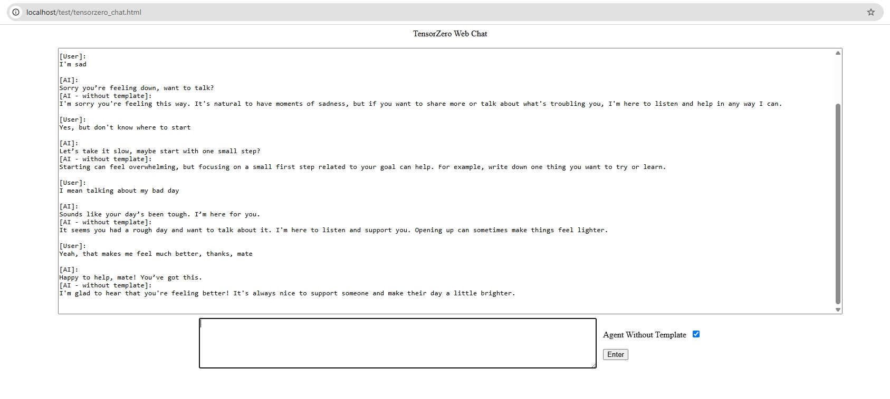

# TensorZero Inference Web Experience UI

## Background
Being invited to experience https://github.com/tensorzero/tensorzero

## Highlights Of TensorZero (personal perspective only)
- Powerful Prompt Template System in terms of input/output content control
- Clean Code
- Dockerized
- Active GitHub Dev Community
- Inference-Time Optimizations (haven't experienced yet)
- More...

## Features of TensorZero
- Inference: access every provider with one API
- Observability: stored in your own database
- Optimization: better prompts, models, and inference strategies
- Experimentation: built-in A/B testing, routing, fallbacks

## My Approach
Created a simplified interactive Web UI to experiment/compare with/without Prompt Template control


## How To Experience (Windows 11)
1. Install Docker
2. Install Node.js
    - To run proxy-server.js to enable cors access from Web browser, currently tensorzero/gateway doesn't allow cors
3. Clone my Repository
4. Initialise Node.js environment
    - Go to cloned folder from console
    - Run `npm init -y`
    - Run `npm i express`
    - Run `npm i http-proxy-middleware`
5. Fill in following values to `TensorZero-Web\config\user_settings.cmd`
```cmd
REM @%YOUR_NETWORD_NAME%: you name it
REM @%YOUR_DB_NAME%: ClickHouse DB name
REM @%YOUR_DB_USER_NAME%: ClickHouse DB user
REM @%YOUR_DB_PASSWORD%: ClickHouse DB password
REM @%YOUR_MOUNT_PATH%: path of 'tensorzero.toml' on your local
REM @%AZURE_SERVICE_KEY%: get it from Azure Portal
SET YOUR_NETWORD_NAME=<FILL_BEFORE_USE>
SET YOUR_DB_NAME=<FILL_BEFORE_USE>
SET YOUR_DB_USER_NAME=<FILL_BEFORE_USE>
SET YOUR_DB_PASSWORD=<FILL_BEFORE_USE>
SET YOUR_MOUNT_PATH=%cd%/config
SET AZURE_SERVICE_KEY=<FILL_BEFORE_USE>
```
    - `5` places to replace
6. Fill in following values to `TensorZero-Web\config\tensorzero.toml`
```
<AZURE_OPENAI_MODEL>
<AZURE_OPENAI_ENDPOINT>
```
    - `4` places to replace
    - TensorZero supports multiple popular LLMs, I used Azure `gpt-4o` model to test
7. Run `start_docker_containers.cmd` in console
    - There might be blockers setting up ClickHouse DB instance on container, I struggled for hours, if you use ClickHouse cloud account might be easier
    - Node.js proxy server is also started at the end of the script
8. Chat in `tensorzero_chat.html`
    - Check/Uncheck `Agent Without Template` to switch off/on Diff for Prompt Template control
    - Press `Enter` key to send message

## Conclusion
- Impressive Features
- Delicately designed system

## Commercialization Instances
A healthcare startup recently leveraged TensorZero to optimize their LLM-powered voice agents, resulting in a ~65% improvement in task success.
